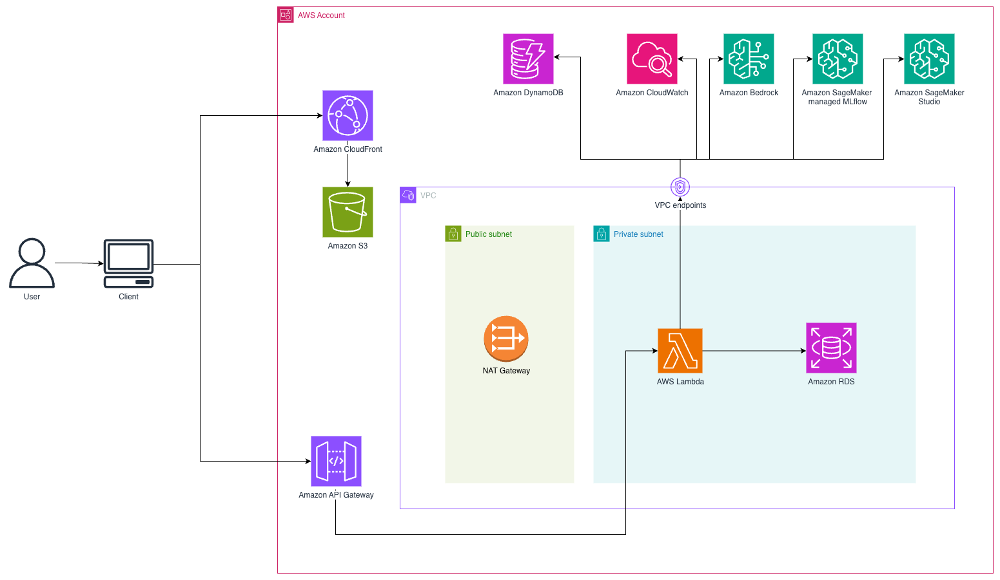

# Build a serverless conversational AI agent using Claude with LangGraph and managed MLflow on Amazon SageMaker AI

This repository demonstrates how to build an intelligent conversational agent using [Amazon Bedrock](https://aws.amazon.com/bedrock/), [LangGraph](https://www.langchain.com/langgraph), and [managed MLflow](https://docs.aws.amazon.com/sagemaker/latest/dg/mlflow.html) on [Amazon SageMaker AI](https://aws.amazon.com/sagemaker-ai/). The conversational AI agent demonstrates a practical implementation for handling customer order inquiries. The system uses a graph-based conversation flow with three key stages:

- **Entry intent** – Identifies what the customer wants and collects necessary information
- **Order confirmation** – Presents found order details and verifies customer intentions
- **Resolution** – Executes the customer's request and provides closure

The solution implements a serverless conversational AI system using a WebSocket-based architecture for real-time customer interactions. The implementation includes real-time WebSocket communication, VPC-secured infrastructure with private subnets for [AWS Lambda](https://aws.amazon.com/lambda/) and RDS, VPC endpoints for [Amazon Web Services](https://aws.amazon.com/) (AWS) services (Bedrock, SageMaker), [Amazon DynamoDB](https://aws.amazon.com/dynamodb/) for conversation state management, [Amazon Relational Database Service (Amazon RDS) for PostgreSQL](https://aws.amazon.com/rds/postgresql/) for structured data storage, and MLflow integration for tracking all [large language model](https://aws.amazon.com/what-is/large-language-model/) (LLM) interactions, performance metrics, and conversation flows.

This repository accompanies the AWS Machine Learning Blog post [Build a serverless conversational AI agent using Claude with LangGraph and managed MLflow on Amazon SageMaker AI](https://aws.amazon.com/blogs/machine-learning/build-a-serverless-conversational-ai-agent-using-claude-with-langgraph-and-managed-mlflow-on-amazon-sagemaker-ai/). Please refer to the blog post for additional context and implementation details.

## Architecture Overview



### Key Components

1. **Modern Serverless Architecture**

   - **WebSocket API Only**: Real-time bidirectional communication
   - **Container-based Lambda**: Fast, efficient deployments

2. **VPC Configuration**

   - Private subnets hosting Lambda and RDS
   - Public subnets with NAT Gateway for outbound traffic
   - VPC Endpoints:
     - Bedrock Runtime
     - Bedrock API
     - SageMaker API

3. **Compute & Services**

   - **Lambda Function** (Container-based):
     - Memory: 4096 MB
     - Timeout: 15 minutes
     - Python 3.12 runtime
     - Docker container deployment
   - **WebSocket API**: Real-time chat communication
   - **Amazon Bedrock**: Claude 3.5 Sonnet model
   - **MLflow 2.16 on SageMaker**: Experiment tracking and model monitoring

4. **Storage & State Management**

   - **DynamoDB Tables**:
     - `bedrock-chatbot-conversations`: Chat history
     - `websocket-connections-v2`: Active WebSocket connections
   - **S3 Buckets**: Frontend hosting and MLflow artifacts
   - **CloudFront**: Content delivery and caching
   - **PostgreSQL RDS**: Structured data storage

5. **Security & Best Practices**
   - [IAM](https://aws.amazon.com/iam/) roles with least privilege principles
   - Security groups with minimal required access
   - VPC endpoints for secure service communication
   - Encryption at rest and in transit


## Prerequisites
To build a serverless conversational AI agent using Claude with LangGraph and managed MLflow on Amazon SageMaker AI, you need the following prerequisites:
AWS account requirements:
<ul>
 	<li>An AWS account with permissions to create Lambda functions, DynamoDB tables, API gateways, S3 buckets, CloudFront distributions, Amazon RDS for PostgreSQL instances, and <a href="https://aws.amazon.com/vpc/" target="_blank" rel="noopener noreferrer">Amazon Virtual Private Cloud</a> (Amazon VPC) resources</li>
 	<li>Amazon Bedrock access with Claude 3.5 Sonnet by Anthropic enabled</li>
</ul>
Development environment:
<ul>
 	<li>The <a href="http://aws.amazon.com/cli" target="_blank" rel="noopener noreferrer">AWS Command Line Interface</a> (AWS CLI) is <a href="https://docs.aws.amazon.com/cli/latest/userguide/getting-started-install.html" target="_blank" rel="noopener noreferrer">installed</a> on your local machine</li>
 	<li><a href="https://github.com/git-guides/install-git" target="_blank" rel="noopener noreferrer">Git</a> and <a href="https://docs.docker.com/engine/install/" target="_blank" rel="noopener noreferrer">Docker</a> utilities are installed on your local machine</li>
 	<li>Permission to create AWS resources</li>
 	<li><a href="https://www.python.org/" target="_blank" rel="noopener noreferrer">Python</a> 3.12 or later</li>
 	<li><a href="https://nodejs.org/en" target="_blank" rel="noopener noreferrer">Node.js</a> 20+ and <a href="https://www.npmjs.com/" target="_blank" rel="noopener noreferrer">npm</a> installed</li>
 	<li><a href="https://docs.aws.amazon.com/cdk/" target="_blank" rel="noopener noreferrer">AWS Cloud Development Kit</a> (AWS CDK) CLI installed (<code>`npm install -g aws-cdk`</code>)</li>
 	<li><a href="https://aws.amazon.com/cloudwatch/" target="_blank" rel="noopener noreferrer">Amazon CloudWatch</a> Logs role <a href="https://docs.aws.amazon.com/IAM/latest/UserGuide/reference-arns.html" target="_blank" rel="noopener noreferrer">Amazon Resource Name</a> (ARN) configured in API Gateway account settings (required for API Gateway logging):
<ul>
 	<li>Create an <a href="https://aws.amazon.com/iam/" target="_blank" rel="noopener noreferrer">AWS Identity and Access Management</a> (IAM) role with required permissions. For guidance, refer to <a href="https://docs.aws.amazon.com/apigateway/latest/developerguide/set-up-logging.html#set-up-access-logging-permissions" target="_blank" rel="noopener noreferrer">Permissions for CloudWatch logging</a>.</li>
 	<li><a href="https://docs.aws.amazon.com/apigateway/latest/developerguide/set-up-logging.html#set-up-access-logging-using-console" target="_blank" rel="noopener noreferrer">Configure the role in the API Gateway console</a>. Follow steps 1–3 only.</li>
</ul>
</li>
</ul>
Skills and knowledge:
<ul>
 	<li>Familiarity with serverless architectures</li>
 	<li>Basic knowledge of Python and React</li>
 	<li>Understanding of AWS services (AWS Lambda, Amazon DynamoDB, Amazon VPC)</li>
</ul>

**Note:** The deployment script automatically authenticates with AWS ECR Public to avoid rate limits when pulling Lambda base images.

## Deployment Guide

### 1. Clone the repository and set up the project root

```bash
# Clone the repository
git clone https://github.com/aws-samples/sample-aws-genai-serverless-orchestration-chatbot-mlflow.git

# Navigate to the project root
cd sample-aws-genai-serverless-orchestration-chatbot-mlflow

# Store the project root path
export PROJECT_ROOT=$(pwd)
```

### 2. Bootstrap AWS Environment (required if bootstrap is not done before)

```bash
cd "$PROJECT_ROOT/infra"
cdk bootstrap
```

Note: CDK bootstrap is required once per AWS account/region combination. If you've already bootstrapped CDK in your target region, you can skip this step.

### 3. Install Dependencies

```bash
# Using the Makefile (recommended)
cd "$PROJECT_ROOT"
make install
```

The install script will:
- Create a Python virtual environment at the project root
- Install Node.js v22.17.1 using nvm (if not already installed)
- Install backend Python dependencies
- Install infrastructure Python dependencies
- Build the Lambda layer for the database initializer
- Install frontend Node.js dependencies
- Build the frontend application

Note: The script uses nvm for Node.js version management to ensure consistency across environments.

### 4. Build and Deploy Application

```bash
# Using the Makefile (recommended)
cd "$PROJECT_ROOT"
make deploy
```

The deployment script will:
1. Authenticate with AWS ECR Public to avoid rate limits
2. Activate the Python virtual environment
3. Load Node.js v22.17.1 via nvm
4. Build the Lambda layer for the database initializer
5. Synthesize the CDK application to check for errors
6. Deploy both stacks in the correct order:
   - **BedrockChatbot-Backend**: Backend infrastructure (VPC, Lambda, RDS, DynamoDB, MLflow, SageMaker)
   - **BedrockChatbot-Frontend**: Frontend with WebSocket API, S3 hosting, CloudFront, and runtime configuration
7. Display deployment outputs including the website URL and WebSocket API URL

CDK automatically handles stack dependencies and cross-stack references.

## Cleanup

To completely remove all resources:

```bash
# Using the Makefile (recommended)
cd "$PROJECT_ROOT"
make clean
```

The cleanup script will:
1. Ask for confirmation before proceeding
2. Empty all S3 buckets to prevent deletion failures
3. Clean up SageMaker EFS file systems
4. Run `cdk destroy --all --force` to remove both stacks
5. Clean up local build artifacts

This ensures all resources are properly removed to avoid ongoing charges.

### Environment Setup (local test)

Create a `.env` file in the `backend/` directory with required configurations:

```
MODELID_CHAT=us.anthropic.claude-3-5-sonnet-20241022-v2:0
AWS_REGION=us-east-1
RDS_SECRET_NAME=arn:aws:secretsmanager:us-east-1:ACCOUNT_ID:secret:ChatbotDatabaseSecret-XXXXX
DYNAMO_TABLE=bedrock-chatbot-conversations
MLFLOW_TRACKING_ARN=arn:aws:sagemaker:us-east-1:ACCOUNT_ID:mlflow-tracking-server/bedrock-chatbot-mlflow
CONNECTIONS_TABLE=websocket-connections-v2
```

Note: Replace `ACCOUNT_ID` and secret suffixes with your actual AWS account values after deployment.

## Application Workflow


### Conversation Flow

1. **Entry Intent** (`entry_intent.py`):

   - Initial message processing
   - Order information extraction

2. **Order Confirmation** (`order_confirmation.py`):

   - Order validation
   - User confirmation handling

3. **Resolution** (`resolution.py`):
   - Final processing
   - Session management

### MLflow Monitoring


- **Automatic Tracing**: All Bedrock calls tracked
- **Performance Metrics**: Response latency, token usage
- **Experiment Organization**: Session-based tracking
- **Model Monitoring**: Performance over time

### Development and Testing

**Notebooks**: The `notebooks/` directory provides Jupyter notebooks for:

- `00-01-Basics.ipynb` through `01-05-Basics.ipynb`: Basic functionality testing and conversation flow examples
- `01-06-MLFlow-basic.ipynb`: MLflow integration testing and experiment tracking
- `01-07-Lambda-test.ipynb`: Lambda function testing and validation

These notebooks help you understand the system behavior, test individual components, and validate MLflow tracking before full deployment.

**Local Testing**:

For local testing, create a `.env` file in the `backend/` directory with the environment variables shown in the "Environment Setup" section above. The application will automatically load these variables when running locally.

## Example Conversations

### Order Lookup

```
I need help with an order
```

```
My order is 32057
```

### Cancel Order

```
I need help with an order
```

```
My order is 37129
```

```
Please cancel my order
```

### Account Lookup

```
Hello, I need some help
```

```
I don't remember my order id
```

```
My email is anacarolina_silva@example.com
```

```
What are my orders
```

### Combining Requests

```
I need to cancel an order but don't remember my order id
```

```
My phone number is 312-555-8204
```

```
Yes
```

## Contributing

See [CONTRIBUTING](CONTRIBUTING.md#security-issue-notifications) for more information.

## License

This library is licensed under the MIT-0 License. See the LICENSE file.