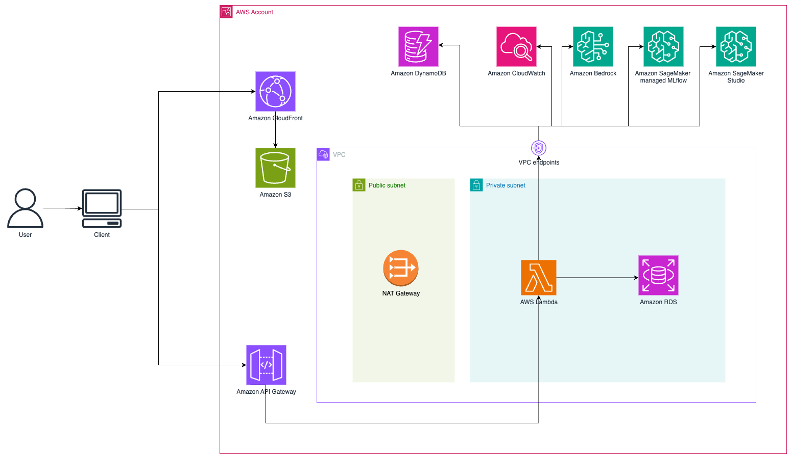
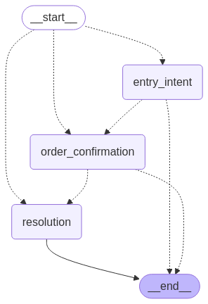
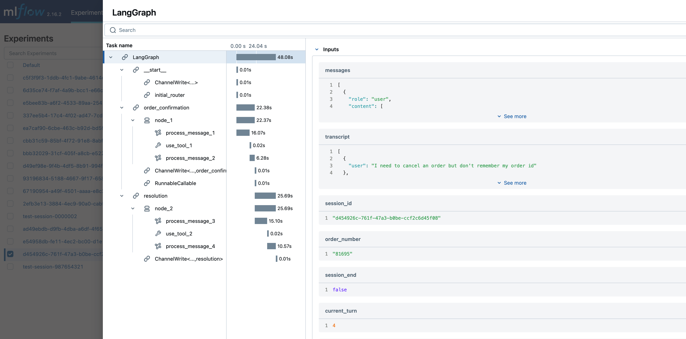

# Build a serverless conversational AI agent using Claude with LangGraph and managed MLflow on Amazon SageMaker AI

This sample shows how to build a serverless conversational AI agent using Claude with angiography and managed MLflow on Amazon SageMaker AI. It demonstrates how to combine the reasoning capabilities of Large Language Models (LLMs) from Amazon Bedrock, the orchestration features of LangGraph, and the observability provided by managed MLflow on Amazon SageMaker AI to create customer service agents.

### Repository Structure

```
project-root/
├── backend/
│   ├── graphs/
│   │   ├── __init__.py
│   │   └── primary_graph.py        # LangGraph workflow definition
│   ├── nodes/
│   │   ├── __init__.py
│   │   ├── entry_intent.py         # Entry node for conversation
│   │   ├── order_confirmation.py   # Order confirmation handling
│   │   └── resolution.py           # Resolution node
│   ├── static/
│   │   └── static.py               # System prompts and configurations
│   ├── tools_config/
│   │   ├── __init__.py
│   │   ├── agent_tool.py           # Tool configurations for agent
│   │   └── entry_intent_tool.py    # Entry intent tool specs
│   ├── utils/
│   │   ├── __init__.py
│   │   ├── rds_utils.py            # Database utility functions
│   │   └── utils.py                # General utilities
│   ├── app.py                      # Agent memory management layer
│   ├── main_handler.py             # Main Lambda entry point (routes events)
│   ├── websocket_handler.py        # WebSocket API Lambda handler
│   ├── requirements.txt            # Python dependencies
│   └── Dockerfile                  # Container definition for Lambda
├── frontend/                       # React frontend application
│   ├── public/
│   ├── src/
│   │   ├── components/
│   │   │   └── Chat.tsx            # Main chat component
│   │   ├── config/
│   │   │   └── api-config.ts       # API configuration
│   │   ├── types/
│   │   │   └── window.d.ts         # TypeScript definitions
│   │   ├── App.tsx                 # Main app component
│   │   └── index.tsx               # Entry point
│   ├── package.json
│   └── tsconfig.json
├── infra/                          # AWS CDK Infrastructure
│   ├── initializerLambda/
│   │   ├── layers/
│   │   ├── build_layer.sh
│   │   ├── data.py
│   │   ├── index.py
│   │   └── requirements.txt
│   ├── lambda_functions/
│   │   └── config_generator.py     # Runtime configuration generator
│   ├── stacks/
│   │   ├── __init__.py
│   │   ├── principal_backend.py      # Main backend infrastructure stack
│   │   ├── principal_frontend.py   # Frontend infrastructure stack
│   │   ├── runtime_config_stack.py # Runtime configuration stack
│   │   ├── websocket_api_stack.py  # WebSocket API definition
│   │   ├── database_stack.py       # PostgreSQL RDS database
│   │   ├── dynamodb_stack.py       # DynamoDB tables (conversations + connections)
│   │   ├── frontend_stack.py       # S3 + CloudFront for React app
│   │   ├── lambda_stack.py         # Lambda function definition
│   │   ├── mlflow_stack.py         # MLflow tracking server on SageMaker
│   │   ├── sagemaker_base_stack.py # SageMaker base resources
│   │   ├── sagemaker_stack.py      # SageMaker domain and user profile
│   │   └── vpc_stack.py            # VPC and networking
│   ├── app.py                      # CDK app entry point
│   ├── cleanup.sh                  # Resource cleanup script
│   └── requirements.txt            # CDK dependencies
├── notebooks/                      # Jupyter notebooks for testing
│   ├── 00-01-Basics.ipynb
│   ├── 01-02-Basics.ipynb
│   ├── 01-03-Basics.ipynb
│   ├── 01-04-Basics.ipynb
│   ├── 01-05-Basics.ipynb
│   ├── 01-06-MLFlow-basic.ipynb
│   └── 01-07-Lambda-test.ipynb
└── images/                         # Architecture diagrams
    ├── graph.png
    ├── infra.png
    ├── infra2.png
    ├── infra3.png
    └── mlflow_trace.png
```

## Architecture Overview



### Key Components

1. **Modern Serverless Architecture**

   - **WebSocket API Only**: Real-time bidirectional communication
   - **Container-based Lambda**: Fast, efficient deployments

2. **VPC Configuration**

   - Private subnets hosting Lambda and RDS
   - Public subnets with NAT Gateway for outbound traffic
   - VPC Endpoints:
     - Bedrock Runtime
     - Bedrock API
     - SageMaker API

3. **Compute & Services**

   - **Lambda Function** (Container-based):
     - Memory: 4096 MB
     - Timeout: 15 minutes
     - Python 3.11 runtime
     - Docker container deployment
   - **WebSocket API**: Real-time chat communication
   - **Amazon Bedrock**: Claude 3.5 Sonnet model
   - **MLflow 2.16 on SageMaker**: Experiment tracking and model monitoring

4. **Storage & State Management**

   - **DynamoDB Tables**:
     - `bedrock-chatbot-conversations`: Chat history
     - `websocket-connections-v2`: Active WebSocket connections
   - **S3 Buckets**: Frontend hosting and MLflow artifacts
   - **CloudFront**: Content delivery and caching
   - **PostgreSQL RDS**: Structured data storage

5. **Security & Best Practices**
   - IAM roles with least privilege principles
   - Security groups with minimal required access
   - VPC endpoints for secure service communication
   - Encryption at rest and in transit

## Deployment Instructions

### Prerequisites

- AWS CLI configured with appropriate permissions
- AWS CDK CLI installed (`npm install -g aws-cdk`)
- Python 3.12 or later
- Docker installed and running
- Node.js 20+ and npm installed
- **CloudWatch Logs role ARN configured in API Gateway account settings** (required for API Gateway logging):
  - [Create IAM role with required permissions](https://docs.aws.amazon.com/apigateway/latest/developerguide/set-up-logging.html#set-up-access-logging-permissions)
  - [Configure the role in API Gateway console](https://docs.aws.amazon.com/apigateway/latest/developerguide/set-up-logging.html#set-up-access-logging-using-console) - steps 1-3 only

### 1. Clone the repository and set up the project root

```bash
# Clone the repository
git clone https://github.com/aws-samples/sample-aws-genai-serverless-orchestration-chatbot-mlflow.git

# Navigate to the project root
cd sample-aws-genai-serverless-orchestration-chatbot-mlflow

# Store the project root path
export PROJECT_ROOT=$(pwd)
```

### 2. Bootstrap AWS Environment (required if bootstrap is not done before)

```bash
cd "$PROJECT_ROOT/infra"
cdk bootstrap
```

### 3. Install Dependencies

```bash
# Using the Makefile (recommended)
cd "$PROJECT_ROOT"
make install

# Or manually:
# Backend dependencies
cd "$PROJECT_ROOT/backend"
pip install -r requirements.txt

# Infrastructure dependencies
cd "$PROJECT_ROOT/infra"
pip install -r requirements.txt

# Build Lambda layer for database initializer
cd "$PROJECT_ROOT/infra/initializerLambda"
chmod +x build_layer.sh
./build_layer.sh

# Frontend dependencies
cd "$PROJECT_ROOT/frontend"
npm install
```

### 4. Build and Deploy Application

```bash
# Using the Makefile (recommended)
cd "$PROJECT_ROOT"
make deploy

# Or step-by-step:
# 1. Build frontend assets (if needed)
cd "$PROJECT_ROOT"
make build

# 2. Deploy complete infrastructure
cd "$PROJECT_ROOT/infra"
cdk deploy --app "python3 app.py" --all --require-approval never
```

This command deploys both stacks in the correct order:

1. **BedrockChatbot-Backend**: Backend infrastructure (VPC, Lambda, Database, MLflow)
2. **BedrockChatbot-Frontend**: Frontend with WebSocket API and runtime configuration

CDK automatically handles stack dependencies and cross-stack references.

### 6. Cleanup Resources

To completely remove all resources:

```bash
# Using the Makefile (recommended)
cd "$PROJECT_ROOT"
make clean

# Or manually:
cd "$PROJECT_ROOT/scripts"
./cleanup.sh
```

This script will:

1. Ask for confirmation before proceeding
2. Empty all S3 buckets to prevent deletion failures
3. Clean up SageMaker EFS file systems
4. Run `cdk destroy --all --force` to remove both stacks
5. Clean up local build artifacts

This ensures all resources are properly removed to avoid ongoing charges.

### Environment Setup (local test)

Create a `.env` file with required configurations:

```
MODELID_CHAT=
MODELID_ROUTE=
AWS_REGION=
RDS_SECRET_NAME=
DYNAMO_TABLE=
MLFLOW_TRACKING_ARN=
CONNECTIONS_TABLE=
```

## Technical Implementation

### Event-Driven Architecture

```python
# main_handler.py - Smart routing
def handler(event, context):
    if 'requestContext' in event and 'routeKey' in event['requestContext']:
        # Route to WebSocket handler
        return websocket_handler(event, context)
```

### WebSocket Communication

- **Routes**: `$connect`, `$disconnect`, `sendMessage`
- **Real-time**: Bidirectional communication
- **State Management**: DynamoDB connection tracking
- **Error Handling**: Graceful connection management

### MLflow Integration

```python
# Automatic experiment tracking
@mlflow.trace
def invoke_bedrock_model(prompt):
    # Bedrock model invocation with automatic tracing
    pass
```

### Container Deployment

```dockerfile
FROM public.ecr.aws/lambda/python:3.11-x86_64
# Optimized for fast cold starts
# Efficient dependency management
CMD ["main_handler.handler"]
```

## Application Workflow



### Conversation Flow

1. **Entry Intent** (`entry_intent.py`):

   - Initial message processing
   - Order information extraction

2. **Order Confirmation** (`order_confirmation.py`):

   - Order validation
   - User confirmation handling

3. **Resolution** (`resolution.py`):
   - Final processing
   - Session management

### MLflow Monitoring



- **Automatic Tracing**: All Bedrock calls tracked
- **Performance Metrics**: Response latency, token usage
- **Experiment Organization**: Session-based tracking
- **Model Monitoring**: Performance over time

### Development and Testing

**Notebooks**: The `notebooks/` directory provides:

- Basic functionality testing
- Conversation flow validation
  - MLflow integration testing

**Local Testing**:

```bash
# Environment setup
export MODELID_CHAT=us.anthropic.claude-3-5-sonnet-20241022-v2:0
export AWS_REGION=us-east-1
export CONNECTIONS_TABLE=websocket-connections-v2
export RDS_SECRET_NAME="arn:aws:secretsmanager:us-east-1:xxxxxxxx:secret:ChatbotDatabaseSecretxxxxxxxx"
export DYNAMO_TABLE="bedrock-chatbot-conversations"
export MLFLOW_TRACKING_ARN="arn:aws:sagemaker:us-east-1:xxxxxxx:mlflow-tracking-server/bedrock-chatbot-mlflow"
```

## Example Conversations

### Order Lookup

```
I need help with an order
```

```
My order is 32057
```

### Cancel Order

```
I need help with an order
```

```
My order is 37129
```

```
Please cancel my order
```

### Account Lookup

```
Hello, I need some help
```

```
I don't remember my order id
```

```
My email is anacarolina_silva@example.com
```

```
What are my orders
```

### Combining Requests

```
I need to cancel an order but don't remember my order id
```

```
My phone number is 312-555-8204
```

```
Yes
```
